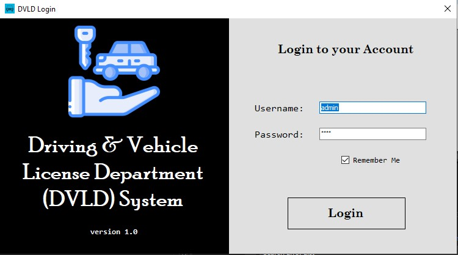
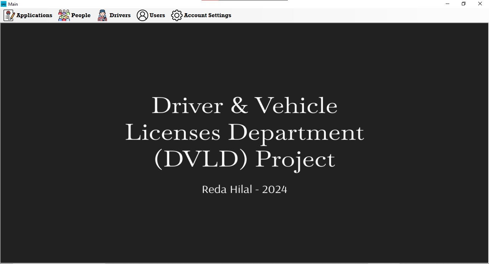
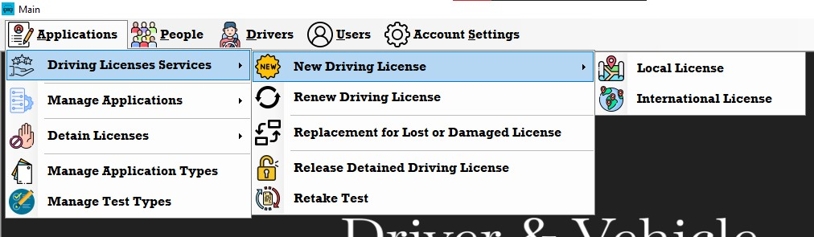
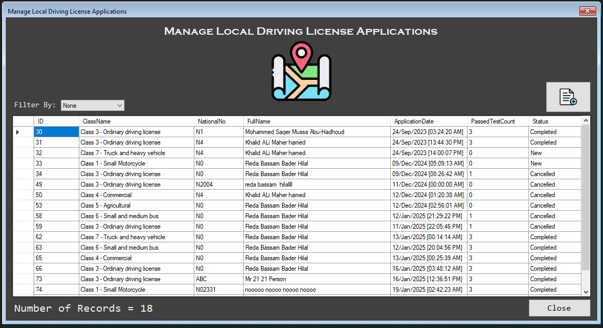
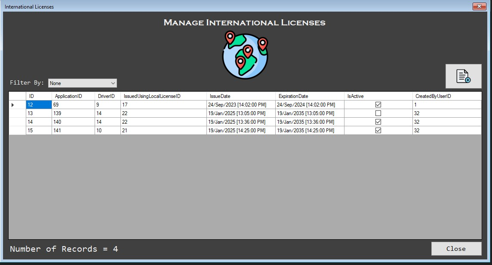
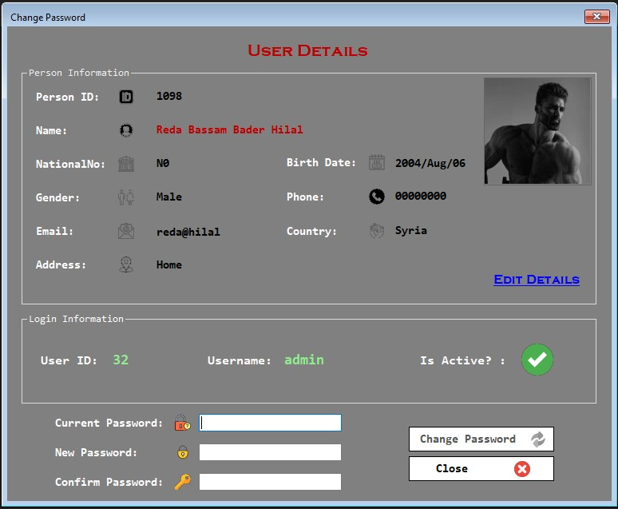
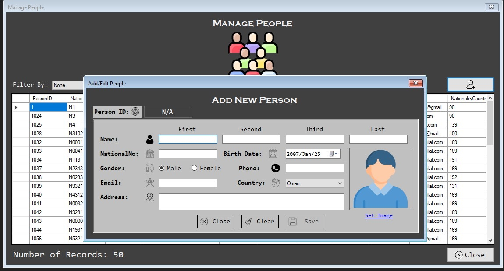
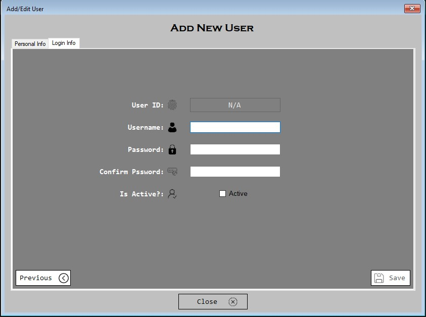

# DVLD System - Driver and Vehicle License Department Desktop Application

## **Project Overview**
The DVLD System is a Windows desktop application designed to automate and streamline the operations of Driver and Vehicle License Departments. It facilitates efficient management of driver licenses, vehicle registrations, and administrative workflows. The system employs CRUD operations and a robust three-tier architecture, ensuring modularity and scalability.

---

## **System Architecture**
The application follows a **Three-Tier Architecture**:
- `Data Access Layer (DAL)`: ADO.NET & SQL Server database for secure and efficient data management.
- `Business Logic Layer (BLL)`: Implemented using C# to process application logic and enforce business rules.
- `Presentation Layer (PL)`: Developed using Windows Forms for an interactive and user-friendly interface.

--
## **Database ERD**

---

## **Features**
The DVLD System includes the following functionalities:

### **People Management**
- Can add, update, delete people info using the manage screen

### **User Management**
- Secure login system requiring a Username and Password.
- Users can change their passwords via a dedicated screen.

### **License Management**
- Application for issuing a license for the first time.
- Handle Vision, Writing, and Street test results.
- Option to retake failed tests.
- License renewal functionality.
- Replacement for damaged or lost licenses.
- Detaining and releasing detained licenses.
- Issuance of international licenses.

### **Administrative Features**
- Management screens for:
  - Application Types
  - License Applications
  - International License Applications
  - Detained License
  - People
  - Users
  - Drivers
  - Tests and Test Types

---

## **Technologies Used**
- **Programming Language:** C#
- **Framework:** Windows Forms
- **Database:** SQL Server

---

## **Screenshots**

### login screen

### main screen

### features

### manage local licenses screen

### manage international licenses screen

### change password screen

### add new person

### add new user

---

